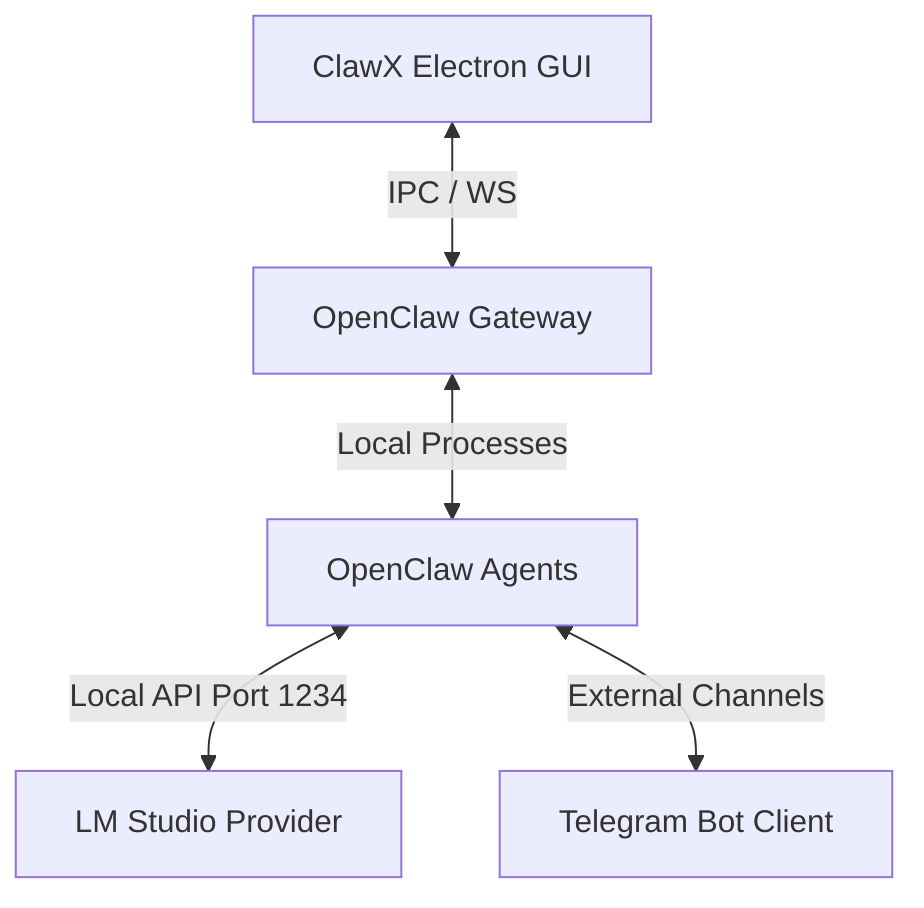

# System Map

## Overview
ClawX is a React 19 + Electron wrapper that serves as the desktop GUI client. It controls the underlying OpenClaw runtime, orchestrating agent execution, local tool execution, and local model providers.

## Key System Paths
* **Code Repository**: [ClawX-main](file:///Users/memphis/Desktop/ClawX-main)
* **ClawX UI Application Data**: [clawx Application Support](file:///Users/memphis/Library/Application%20Support/clawx)
* **OpenClaw Config & Memory**: [openclaw Config](file:///Users/memphis/.openclaw)
